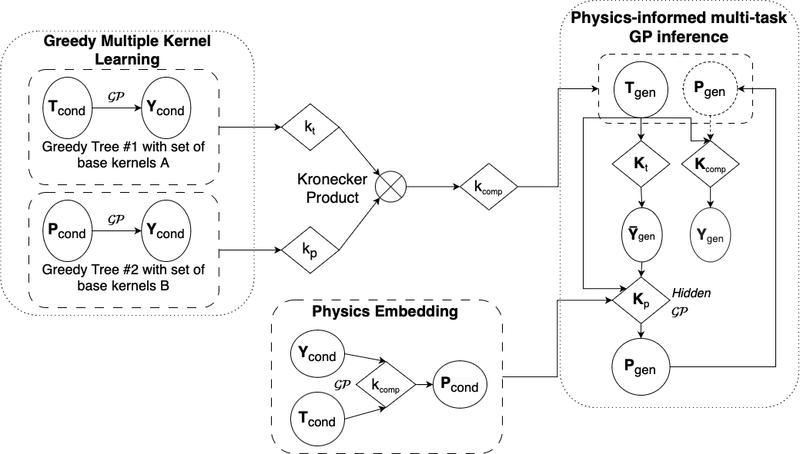
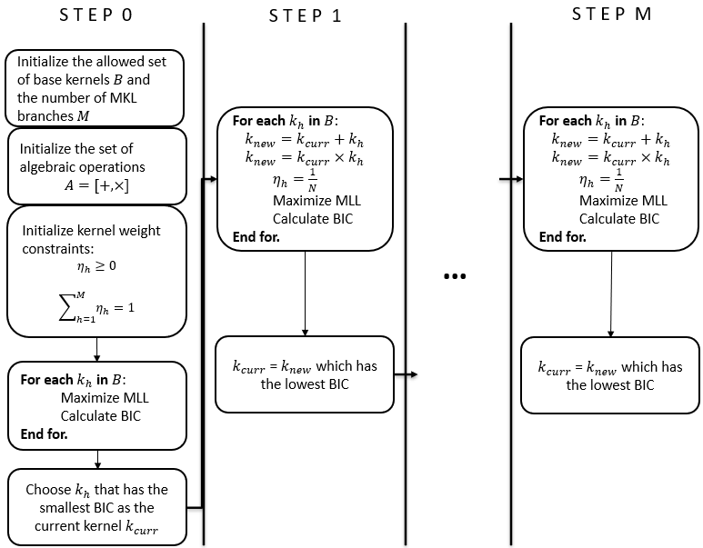
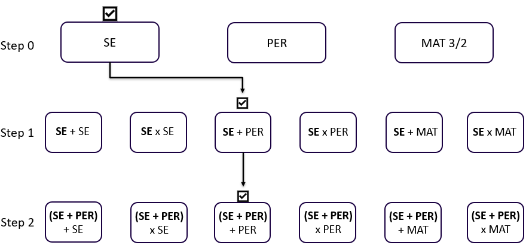
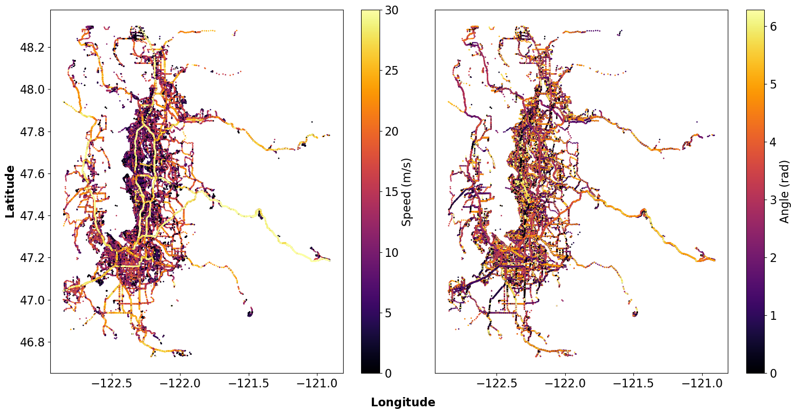
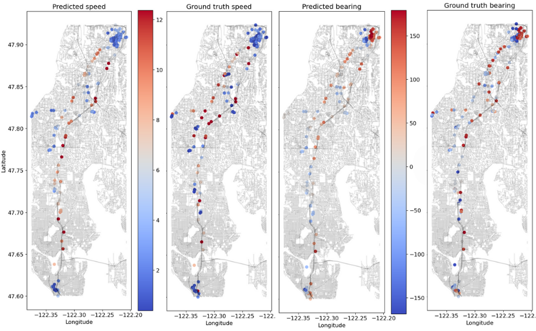
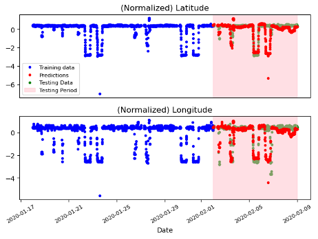

# Learning to generate synthetic human mobility data: A physics-regularized Gaussian process approach based on multiple kernel learning
### Ekin Uğurel, Shuai Huang, Cynthia Chen, *Transportation Research Part B: Methodological*, 2024, 103064.
#### *Podium presentation at the International Symposium on Transportation and Traffic Theory (ISTTT) 25*

This repo contains object classes, helper functions, and other codes pertinent to the above-referenced paper. 
<div align='center'>
</img>
</div>
<br />

## MKL

<div align='center'>
</img>
</div>
<br />

<div align='center'>
</img>
</div>
<br />

## Physics-regularization
<div align='center'>
</img>
</div>
<br />

<div align='center'>
</img>
</div>
<br />

## Generating synthetic mobile data
<div align='center'>
</img>
</div>
<br />

## Setup
The code was written in Python 3.10.8.

The following libraries are the minimal required libraries to run the code: 
```python
import torch
import gpytorch
import tqdm
import pandas
import numpy
import sklearn
import similaritymeasures
import matplotlib
import pypots
import skmob
import scipy
import geopandas
```
or you can have everything set up by running: 
```bash
pip install -r requirements.txt
```

## Usage
For example to train and test the model on the GeoLife dataset execute the following command (insert your own paths after cloning):
```
python GeoLifeScript.py --input_path_traj {INSERT PATH}/physics-regularized-MTGP/ --input_path_comp {INSERT PATH}/physics-regularized-MTGP/data --output_path {INSERT PATH}/physics-regularized-MTGP/results
```

## Code Structure
- 'geolife' and 'compressed_geolife' folders: contains the raw trajectories of GeoLife users with mode labels and processed trips to show compressed information, respectively.
- GP.py: contains the core exact GP class object used during training
- GeoLifeScript.py: main script for the experiment shown in Section 4.4.
- MKL.py: contains the greedy MKL class object used to learn the composite spatiotemporal kernels
- benchmarkMethods.py: contains an implementation of the LSTM network (and MC simulations of it) used to benchmark our method
- helper_func.py: contains various helper functions referenced in the main script
- methods.py: contains other helpful methods like adding distances, velocities, and bearings onto mobile data
- metrics.py: contains functions to calculate various metrics leveraged in the main script
- models.py: contains the class objects for the full model and its sparse sister
- plots.py: contains various plotting functions
- sgp.py: contains the core class objects for the sparse GP model
- utils.py: contains utility functions referenced in the main script

## Licensing
See the [LICENSE](LICENSE) file for licensing information as it pertains to files in this repository.

## Contact
Ekin Uğurel (ugurel [at] uw.edu)
